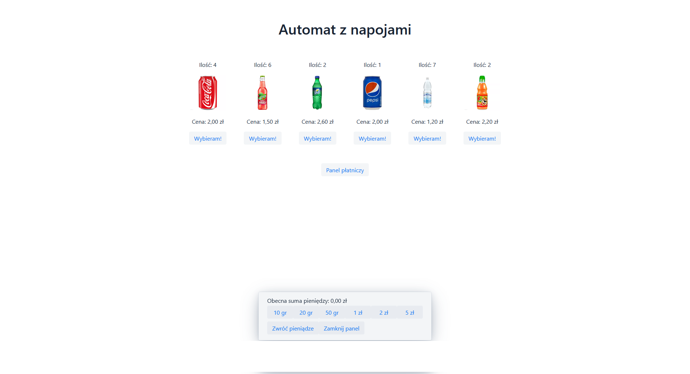

# Automat

Internet application simulating the operation of a vending machine with drinks. It allows you to toss coins, buy products, and refund money.

 * Author: Karol Jaskot
 * Student PWSZ in Legnica
 * E-mail: karol.jaskot97@gmail.com
> 

##

This project is hosted and ready to use. (the application is currently not adapted to mobile devices) App adress:
https://automat-jaskot.herokuapp.com/

##

The project is also available as a docker image: https://hub.docker.com/repository/docker/karoljaskot/automat

### Tech

* SpringBoot - Spring Boot makes it easy to create stand-alone, production-grade Spring based Applications that you can "just run".!
* Vaadin - open source web framework that helps Java developers build great user experiences with minimal effort.

### Main view



### Installation

IntelijIdea is required to open this program. 


Install project:
```sh
mvn clean
mvn install
```
To start this project:
```sh
mvn spring-boot:run
```

Thanks to that it will be available at =  localhost: 8080


If port 8080 is not available, you can change the address in the file:
```sh
/src/main/resources/application.properties
```
